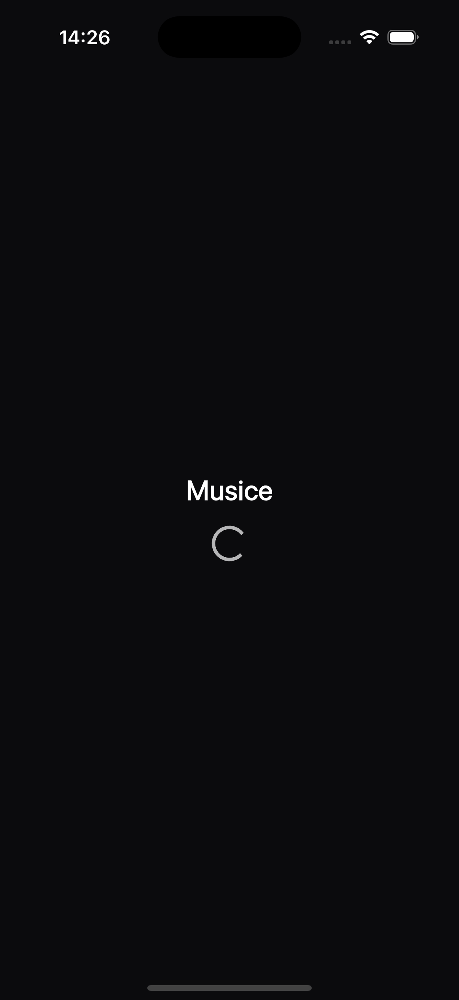
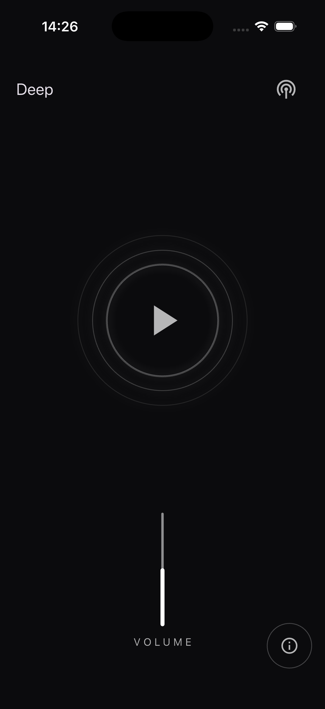
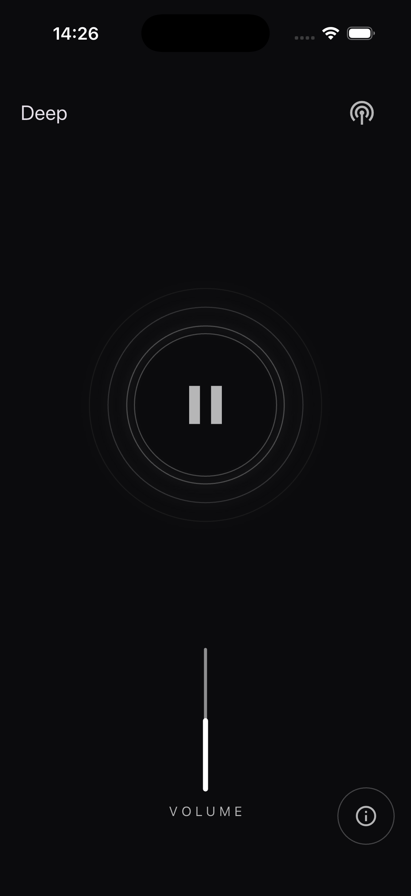

# Musice — минималистичное радио на Flutter

Musice — это небольшой кроссплатформенный радио‑плеер на Flutter. Приложение воспроизводит интернет‑радио (HLS), позволяет выбрать станцию, управлять воспроизведением и громкостью, а также показывает «реактивную» анимацию, которая пульсирует в такт проигрыванию.


## Возможности
- Выбор радиостанции через нижний модальный лист (с безопасным запасным диалогом, если лист не открылся)
- Воспроизведение потоков HLS с помощью `just_audio`
- Кнопка Play/Pause с отображением статусов загрузки/буферизации
- Плавный регулятор громкости с «анимированным» применением значения
- Реактивная анимация «волн» во время проигрывания
- Тёмная тема, шрифт SF Pro
- Для desktop (macOS/Windows/Linux) — фиксированное окно 390×844 (как iPhone 14) через `window_manager`


## Скриншоты

- Главный экран:  
  
- Выбор станции:  
  
- Проигрывание и громкость:  
  


## Технологии
- Flutter (Material 3)
- Dart (см. ограничения SDK в `pubspec.yaml`)
- just_audio
- window_manager


## Быстрый старт

Требования:
- Установленный Flutter SDK (stable)
- Для iOS/macOS: Xcode, CocoaPods
- Для Windows: инструменты сборки Flutter Desktop

Установка зависимостей:
```zsh
flutter pub get
```

Запуск:
- macOS (desktop):
  ```zsh
  flutter run -d macos
  ```
- iOS (симулятор/устройство):
  ```zsh
  flutter run -d ios
  ```
  Примечание: для реального устройства настройте подпись в Xcode (открыть `ios/Runner.xcworkspace`).
- Windows (desktop):
  ```zsh
  flutter run -d windows
  ```

Сборка релиза (примеры):
- macOS:
  ```zsh
  flutter build macos
  ```
- iOS (архив через Xcode рекомендуется):
  ```zsh
  flutter build ipa
  ```
- Windows:
  ```zsh
  flutter build windows
  ```


## Тесты
Запустить все unit/widget тесты:
```zsh
flutter test
```
Тестовые файлы: `test/widget_test.dart`, `test/radio_home_page_test.dart`.


## Структура проекта (основное)
- `lib/main.dart` — входная точка: выбор/старт станции, управление плеером и анимацией, фиксированное desktop‑окно
- `lib/models/station.dart` — модель радиостанции
- `lib/widgets/` — UI‑компоненты:
  - `radio_header.dart` — заголовок с выбором станции
  - `play_section.dart` — секция с Play/Pause и анимацией
  - `volume_section.dart` — регулятор громкости с анимированным применением
  - `station_picker_sheet.dart` — модальный лист выбора станции
  - `wave_pulse.dart` — визуализация «волн»
- `lib/assets/` — изображения/скриншоты
- `lib/fonts/` — шрифт SF Pro (подключён как `family: SFPro` в `pubspec.yaml`)
- `test/` — тесты


## Как добавить/изменить радиостанции
Станции определены в списке `_stations` внутри `lib/main.dart`. Пример элемента:
```text
const Station('Deep', 'https://example.com/playlist.m3u8')
```
Добавьте новую станцию по аналогии — она появится в списке выбора.


## Поведение на разных платформах
- Desktop (macOS/Windows/Linux): окно фиксированного размера 390×844. Задаётся при старте через `window_manager` и соответствует портретной ориентации телефона.
- iOS: полноэкранный мобильный режим.


## Нюансы и советы
- Потоки HLS должны быть доступны из вашей сети. Если воспроизведение не начинается, проверьте доступность URL и сетевые ограничения/VPN/файрвол.
- Ошибки старта/буферизации логируются через `debugPrint` (см. консоль).
- Если при выборе станции нижний лист не открылся (редко), сработает запасной диалог.


## Частые проблемы (Release) и их решение
- macOS: приложение в Release не воспроизводит поток.
  - Причина: в режиме sandbox по умолчанию запрещены исходящие сетевые соединения.
  - Решение: в `macos/Runner/Release.entitlements` добавлен ключ `<key>com.apple.security.network.client</key><true/>` (разрешение на исходящие соединения). После изменения пересоберите приложение.
  - Сборка и запуск релизной версии для проверки:
    ```zsh
    flutter build macos
    open build/macos/Build/Products/Release/musice.app
    ```
- iOS: не стартует поток в релизе.
  - Убедитесь, что в `ios/Runner/Info.plist` есть `NSAppTransportSecurity -> NSAllowsArbitraryLoads = true` или включён HTTPS у потоков (указанные HLS‑URL уже `https`).
  - Для фонового воспроизведения включите в Xcode Background Modes -> Audio (необязательно для работы на экране).

Если проблема сохраняется, запустите релизную сборку из консоли и приложите логи:
```zsh
flutter run -d macos --release
```


## Дизайн‑токены (константы)
Все ключевые константы UI собраны в одном месте: `lib/constants/app_constants.dart`.
Это облегчает поддержку единого стиля и быстрые правки.

Доступные группы токенов:
- AppColors — цвета (фон, белые оттенки, разделители/обводки, акцент, прозрачный)
- AppSpacing — отступы (xs…xxxl)
- AppRadii — радиусы (s/m/l) и готовые BorderRadius (brS, brM, brL), а также маленький `handle`
- AppFonts — шрифтовое семейство (по умолчанию 'SFPro')
- AppTypography — базовая типографическая шкала (размеры headline/title/body/label/caption)
- AppTextStyles — именованные текстовые стили (headline, title, body, bodyMuted, captionMuted, labelCaps)

Как это подключено в теме:
- В `lib/main.dart` маппинг `ThemeData.textTheme` перенастроен на `AppTextStyles`,
  чтобы виджеты могли использовать `Theme.of(context).textTheme` и единые стили.

Как пользоваться в коде:
- Цвета: `AppColors.white70`, `AppColors.background`, `AppColors.stroke`
- Отступы: `const SizedBox(height: AppSpacing.m)`, `EdgeInsets.symmetric(horizontal: AppSpacing.l)`
- Радиусы: `BorderRadius.circular(AppRadii.m)` или готовые `AppRadii.brM`
- Текст: либо через тему (`theme.textTheme.headlineSmall`), либо напрямую `AppTextStyles.title`

Как расширять/менять:
1) Добавить токен
   - Откройте `lib/constants/app_constants.dart`
   - В нужный раздел (например, `AppColors` или `AppSpacing`) добавьте константу
   - При необходимости добавьте новый стиль в `AppTextStyles`
2) Применить
   - Замените хардкод в виджетах на новые токены
   - При добавлении новых текстовых ролей — при желании добавьте их в маппинг темы в `main.dart`

Это обеспечивает единообразие интерфейса и ускоряет рефакторинг.


## Лицензия
MIT — см. файл `LICENSE` в корне репозитория.

© 2025 imbrickiy
